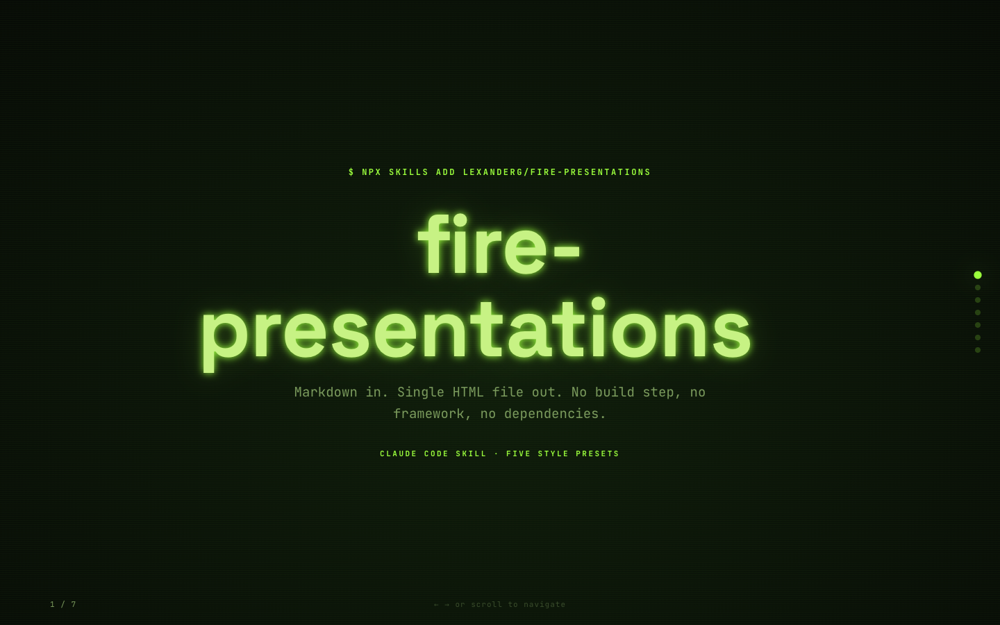
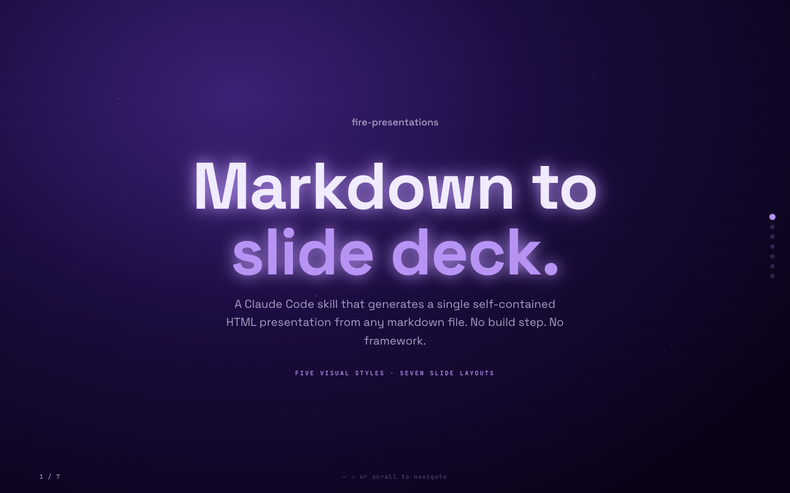
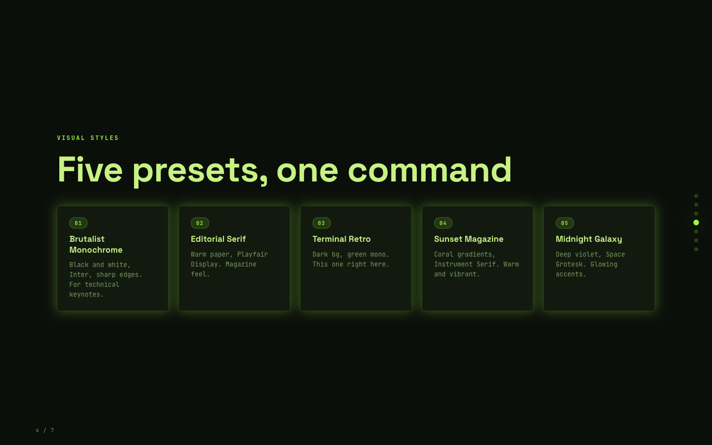
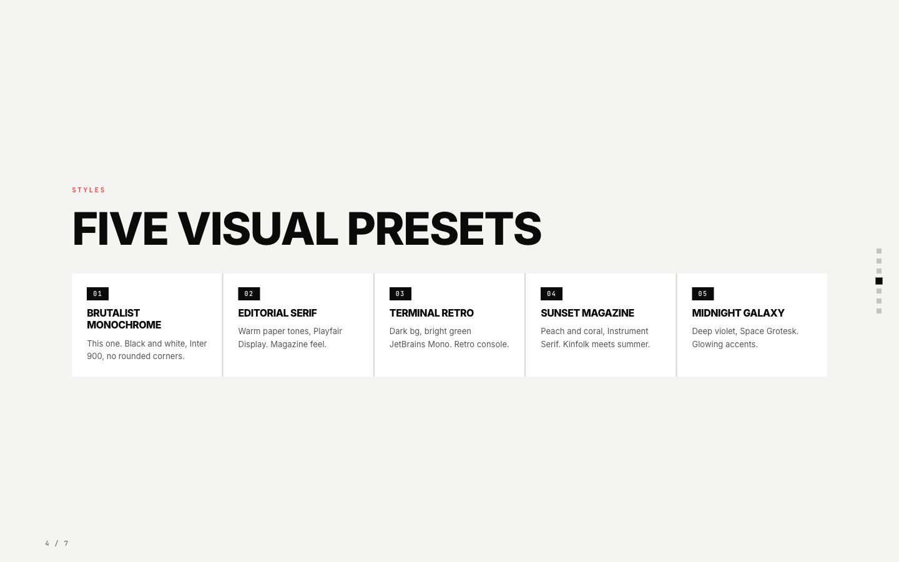

A Claude Code skill that turns a markdown file into a slide deck. The output is a single self-contained HTML file with no build step, no dependencies, and no framework — just open it in a browser.

## What it does

Point it at a markdown file, pick a visual style, and it generates a full-screen scrolling presentation with:

- Scroll-snap slides, each exactly 100dvh tall
- Keyboard navigation (arrow keys, space, page up/down, home/end)
- Side dot navigation with slide counter
- Reveal animations (disabled automatically if the user prefers reduced motion)
- Five built-in style presets, or describe your own

## Style presets

| Name | Feel |
|------|------|
| Brutalist Monochrome | Black and white, Inter, sharp edges |
| Editorial Serif | Warm paper tones, Playfair Display |
| Terminal Retro | Dark background, green JetBrains Mono |
| Sunset Magazine | Peach and coral gradients, Instrument Serif |
| Midnight Galaxy | Deep violet, Space Grotesk, glowing accents |

## Previews

<table>
<tr>
<td align="center"><br/><sub>Terminal Retro — hero</sub></td>
<td align="center"><br/><sub>Midnight Galaxy — hero</sub></td>
<td align="center"><br/><sub>Brutalist Monochrome — hero</sub></td>
</tr>
<tr>
<td align="center"></td>
<td align="center"></td>
<td align="center"></td>
</tr>
</table>

## Slide types

Seven layouts are available: hero, section-divider, content, cards, split, diagram, and quote. The skill infers the right type from your markdown structure, or you can use fenced blocks to be explicit.

Plain markdown works fine:

- An H1 alone becomes a hero slide
- An H2 with bullets becomes a content slide
- Two columns separated by `||` become a split slide

## Install

```bash
npx skills add orchestratedbyalex/fire-presentations
```

That's it. The skill is added to your Claude Code setup and `/fire-presentations` is available straight away.

To install manually, clone this repo into your skills directory instead:

```bash
git clone https://github.com/orchestratedbyalex/fire-presentations.git ~/.claude/skills/fire-presentations
```

## Usage

Invoke it with `/fire-presentations` followed by a path to your markdown file, or just run `/fire-presentations` and it will ask.

## Files

- `SKILL.md` — the skill instructions Claude follows
- `template.html` — the base HTML/JS engine
- `styles.md` — the five style presets as CSS variable blocks
- `slide-types.md` — layout patterns and HTML fragments for each slide type
- `example.md` — a sample markdown file showing all the slide types
